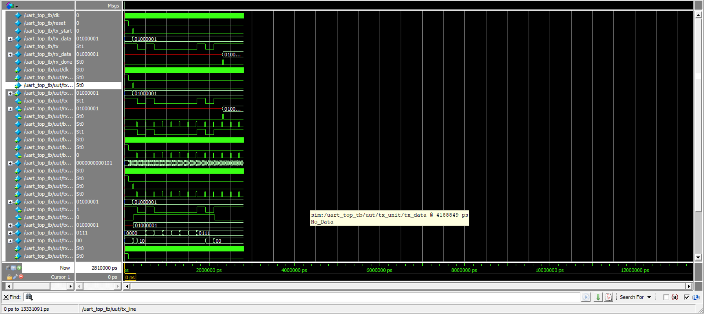
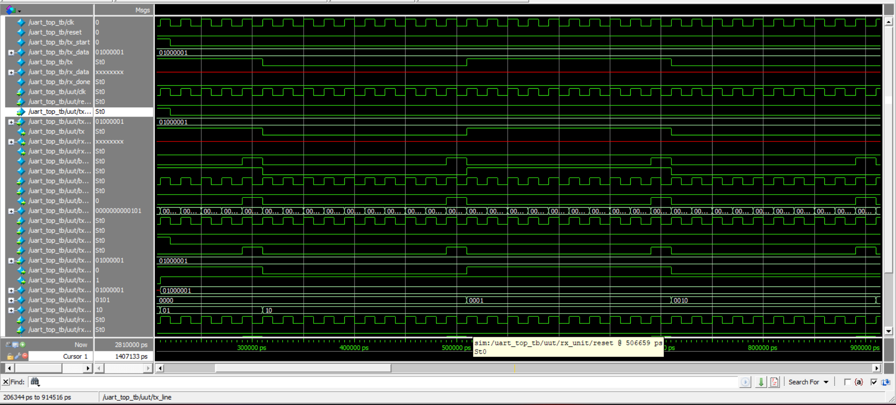

# UART RTL Design and Verification

A complete RTL implementation of a **Universal Asynchronous Receiver Transmitter (UART)** using **Verilog HDL**, including UART Transmitter, Receiver, Baud Rate Generator, Testbench, and ModelSim simulation.

---

## Project Overview

This project implements a complete UART communication interface using Verilog HDL. The design follows a modular RTL approach and verifies data transmission and reception through functional simulation in ModelSim.

---

## Features

- UART Transmitter
- UART Receiver
- Baud Rate Generator
- Loopback Communication
- RTL Design
- FSM Based Architecture
- ModelSim Functional Verification

---

# Project Structure

```
UART_PROJECT
│
├── docs/
│
├── report/
│
├── rtl/
│   ├── baud_gen.v
│   ├── uart_tx.v
│   ├── uart_rx.v
│   ├── uart_top.v
│   └── uart_top_tb.v
│
├── screenshots/
│   ├── Screenshot 2026-05-31 083640.png
│   ├── Screenshot 2026-05-31 083914.png
│   ├── Screenshot 2026-05-31 084056.png
│   ├── Screenshot 2026-05-31 084159.png
│   ├── Screenshot 2026-05-31 084359.png
│   ├── Screenshot 2026-05-31 084515.png
│   └── Screenshot 2026-05-31 084956.png
│
├── tb/
│
├── work/
│
├── README.md
└── vsim.wlf
```

---

# Block Diagram

> Add your block diagram here.

```md

```

---

# RTL Design

The UART consists of the following RTL modules:

| Module | Description |
|----------|-------------|
| baud_gen.v | Generates baud tick |
| uart_tx.v | UART Transmitter |
| uart_rx.v | UART Receiver |
| uart_top.v | Top module integrating TX and RX |
| uart_top_tb.v | Testbench for simulation |

---

# UART Frame Format

```
+---------+----+----+----+----+----+----+----+----+---------+
| Start   | D0 | D1 | D2 | D3 | D4 | D5 | D6 | D7 | Stop |
+---------+----+----+----+----+----+----+----+----+---------+
```

- 1 Start Bit
- 8 Data Bits
- 1 Stop Bit

---

# Finite State Machine

## UART Transmitter

- IDLE
- START
- DATA
- STOP

## UART Receiver

- IDLE
- DATA
- STOP

---

# Baud Rate Generator

The baud generator divides the system clock to generate the required baud tick.

Example:

- System Clock : **50 MHz**
- Baud Rate : **9600**

Divider:

```
50,000,000 / 9600 ≈ 5208
```

---

# Simulation

Simulation was performed using **ModelSim Intel FPGA Edition**.

Input Data

```
8'h41
```

Output Data

```
8'h41
```

Result

✅ Successful UART Transmission and Reception

---

# Simulation Results

## RTL Schematic

```

```

---

## Top Module

```

```

---

## Waveform

```

```

---

## Transmitter

```

```

---

## Receiver

```

```

---

## Simulation Output

```

```

---

## Final Verification

```

```

---

# Technologies Used

- Verilog HDL
- ModelSim
- RTL Design
- Digital Logic Design

---

# Applications

- FPGA Design
- Embedded Systems
- UART Communication
- GPS Modules
- Bluetooth Modules
- Serial Debugging
- Industrial Automation

---

# Future Improvements

- FIFO Buffer
- Parity Bit Support
- Configurable Baud Rate
- Interrupt Support
- FPGA Hardware Implementation

---

# Learning Outcomes

- UART Protocol
- RTL Design
- Finite State Machine
- Verilog HDL
- Serial Communication
- ModelSim Simulation
- Digital Hardware Verification

---

# References

- Texas Instruments UART User Guide
- IEEE Verilog HDL Standard
- UART Communication Protocol Documentation

---

# Author

**Mrunali Jibhakate**

Electronics Engineering | Software Development | Digital Design | FPGA | Verilog | C++ | DSA

- GitHub: https://github.com/mrunali0204
