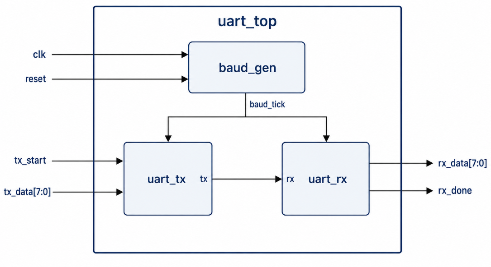
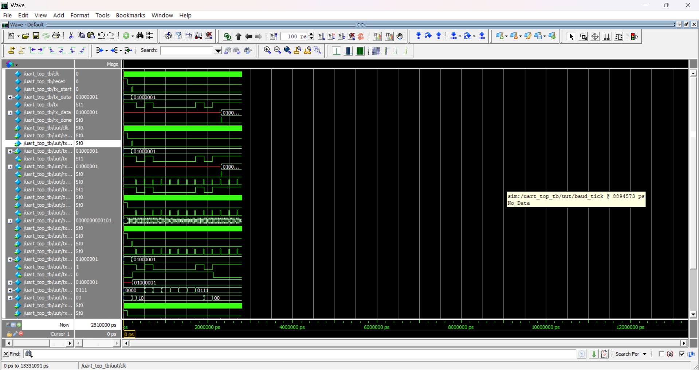
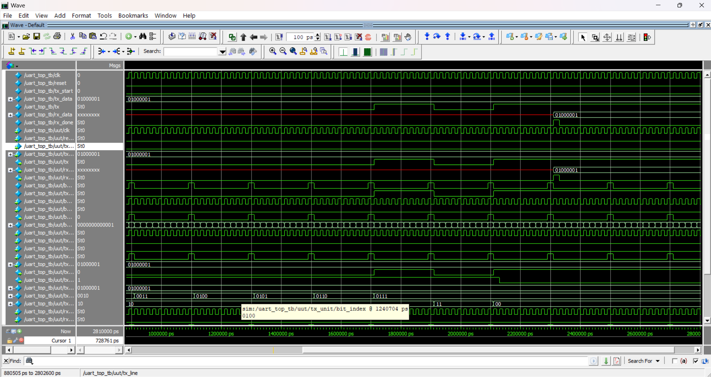
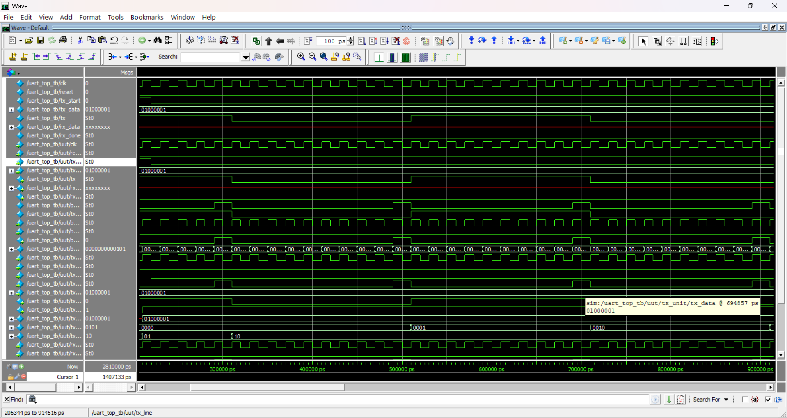
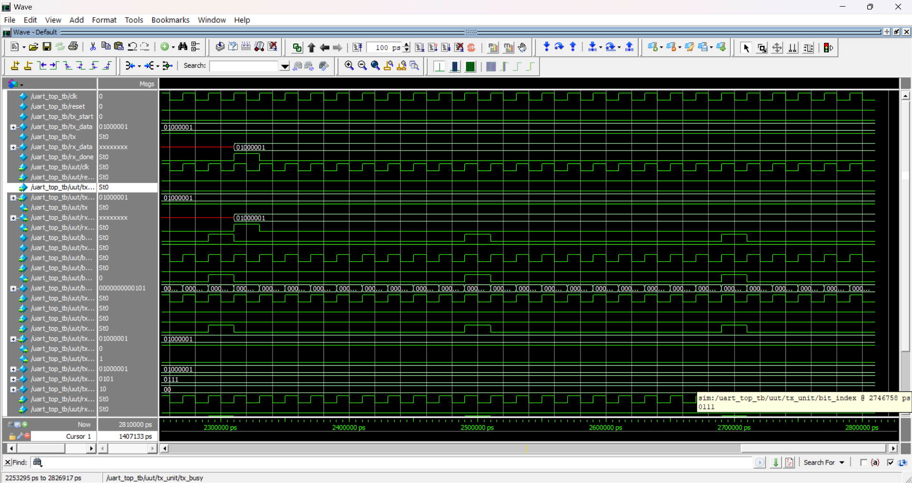

# UART RTL Design and Verification

A complete UART (Universal Asynchronous Receiver Transmitter) RTL Design and Verification project implemented in Verilog HDL. This project includes UART Transmitter, Receiver, Baud Rate Generator, Top Module Integration, and functional verification using ModelSim.

---

## 📂 Project Structure

```text
UART_PROJECT/
│── docs/
│   └── report/
│
│── rtl/
│   ├── baud_gen.v
│   ├── uart_tx.v
│   ├── uart_rx.v
│   ├── uart_top.v
│   └── uart_top_tb.v
│
│── tb/
│
│── screenshots/
│   ├── block_diagram.png
│   ├── Screenshot1.png
│   ├── Screenshot2.png
│   ├── Screenshot3.png
│   ├── Screenshot4.png
│   ├── Screenshot5.png
│   └── Screenshot6.png
│
│── work/
│── README.md
└── vsim.wlf
```

---

# Features

- UART Transmitter
- UART Receiver
- Baud Rate Generator
- Top-Level Integration
- RTL Design using Verilog HDL
- Functional Verification
- ModelSim Simulation

---

# Block Diagram



---

# RTL Modules

### 1. baud_gen.v
Generates the baud clock required for UART communication.

### 2. uart_tx.v
Implements UART data transmission including:
- Start Bit
- Data Bits
- Stop Bit

### 3. uart_rx.v
Implements UART data reception including:
- Start Bit Detection
- Data Sampling
- Stop Bit Verification

### 4. uart_top.v
Top-level module integrating:
- Baud Generator
- UART Transmitter
- UART Receiver

### 5. uart_top_tb.v
Testbench used for simulation and verification.

---

# Simulation Results

### Simulation 1



---

### Simulation 2


---

### Simulation 3



---

### Simulation 4


---

### Simulation 5



---

### Simulation 6



---

# Tools Used

- Verilog HDL
- ModelSim
- Visual Studio Code
- Git
- GitHub

---

# How to Run

Compile the design:

```bash
vlog rtl/*.v
```

Start simulation:

```bash
vsim uart_top_tb
```

Run simulation:

```bash
run -all
```

---

# Future Enhancements

- Configurable Baud Rate
- Parity Bit Support
- FIFO Buffer
- Interrupt Support
- Configurable Data Width

---

# Author

**Mrunali Jibhakate**

Electronics Engineering | Software Development | Digital Design | FPGA | Verilog | C++ | DSA

- GitHub: https://github.com/mrunali0204
